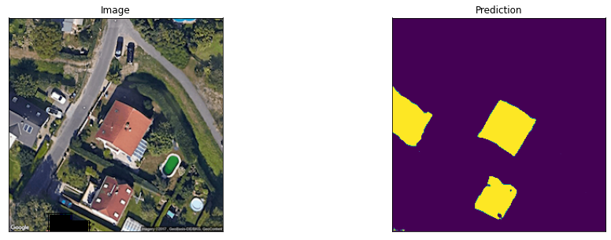

# Segmentation Task

How do we get to this?

---

# Problem Description

Similar to image classification.

Instead of classifying the class of the image - classfiy every pixel.

Image | Mask 
:-:|:-:
|

---

# General Idea

Encoder - Decoder architecture

Compress image to dense representation [Encoder]

Decode image from dense representation [Decoder]

Why? Receptive Fields in the dense representation is (nearly) global.

---

# Spatial information

We loose spatial (positional) information

If I tell you there is a dog in a image, can you tell me where it is?

No.

--- 

---

# Huh..

https://pytorch.org/tutorials/beginner/deep_learning_60min_blitz.html
